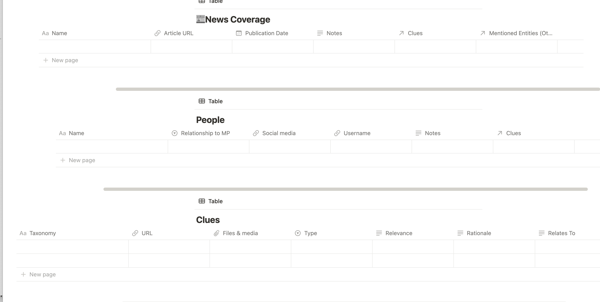
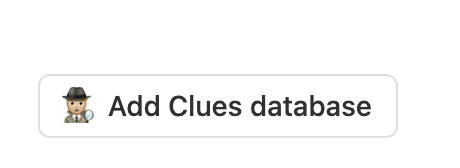
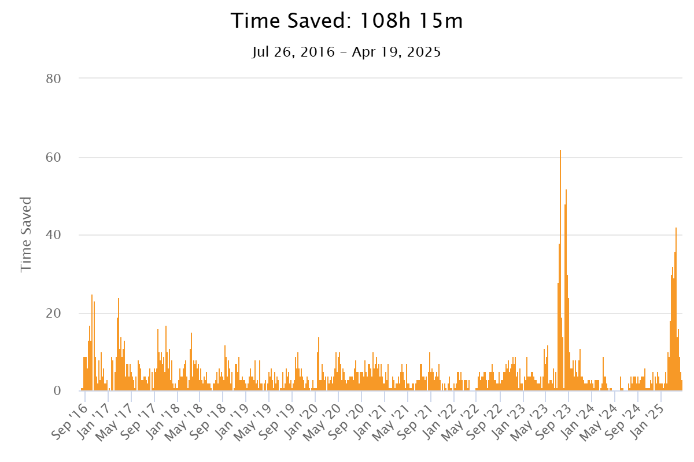

# Collective Animal Collective: April 2025 CTF

*A fascinating tale of how a motley crew of savage beasts evolved into animals of a higher breed in only approximately one (1) fiscal quarter!* 

Approx Reading Time: One (1) Cenozoic Era

## 🦠🦠🦠🦠➡️➡️➡️🐗?

<!-- TOC -->
- [Collective Animal Collective: April 2025 CTF](#collective-animal-collective-april-2025-ctf)
  - [🦠🦠🦠🦠➡️➡️➡️🐗?](#️️️)
- [Acknowledgements](#acknowledgements)
- [Last Season on “*Collective Animal Collective Goes to a Search Party*”](#last-season-on-collective-animal-collective-goes-to-a-search-party)
    - [Post-November CTF Goals and Strategy](#post-november-ctf-goals-and-strategy)
- [The April, 2025 CTF: Results, Process, Analysis](#the-april-2025-ctf-results-process-analysis)
  - [Results: Final Score and Ranking](#results-final-score-and-ranking)
  - [Process](#process)
    - [Comms](#comms)
    - [Timing and Handoffs](#timing-and-handoffs)
    - [Workflow](#workflow)
  - [Tools](#tools)
  - [What Went Well](#what-went-well)
  - [Challenges: Cases](#challenges-cases)
    - [Case A](#case-a)
    - [Case B](#case-b)
    - [Case C](#case-c)
    - [Case D](#case-d)
    - [Reflection](#reflection)
  - [Challenges: Workflow](#challenges-workflow)
    - [Workflow Challenge #1: ~~Indiana Jones~~ Collective Animal Collective and the Template of Doom or at Least Moderate Exasperation](#workflow-challenge-1-indiana-jones-collective-animal-collective-and-the-template-of-doom-or-at-least-moderate-exasperation)
    - [Workflow Challenge #2: Stopping just short of a centralized workflow](#workflow-challenge-2-stopping-just-short-of-a-centralized-workflow)
    - [Workflow Challenge #3: Data entry latency](#workflow-challenge-3-data-entry-latency)
  - [Challenges: Setup](#challenges-setup)
    - [Physical](#physical)
    - [Digital](#digital)
  - [Miscellaneously Challenging Challenges](#miscellaneously-challenging-challenges)
- [Goals for Next CTF](#goals-for-next-ctf)
  - [🎯 Strategy: Identify Informational Goals](#strategy-identify-informational-goals)
  - [⚙️ Process: Improve Workflow](#️-process-improve-workflow)
  - [🏃🏼‍♀️ Process: Be *faster*](#️-process-be-faster)
  - [🫂 Overall: Emotional Care](#-overall-emotional-care)

# Acknowledgements

*Before anything else, I want to thank [Trace Labs](https://www.tracelabs.org/initiatives/search-party) for hosting such a positive, well-organized, and meaningful event. I want to thank Belouve in particular for his incredible patience with the registration hiccup we encountered. Our team’s coach, Oliver, gave us a lot of constructive and helpful feedback as well as impressively fast rulings on our submitted flags. Most of all, I want to thank the collective Collective Animal Collective team for their time, efforts, patience, constructive criticism, and sharing their talent and experience.*

# Last Season on “*Collective Animal Collective Goes to a Search Party*”

The November, 2024, Search Party was the first CTF  I had ever participated in, and it was the first TL/OSINT CTF for both of my teammates. We didn’t really do a lot of planning. Our main pre-CTF discussions were about what to name the team, which *is* crucially important…I mean, we were competing against teams with some top-shelf dad-joke names like Hackstreet Boys. 

Our team of three placed 75/102; our score was over 1000 but I didn’t get the exact number before the leaderboard was taken down. 

We all agreed the event was a *lot* more fun and rewarding than we’d expected, and we all planned on doing the next one. 

### Post-November CTF Goals and Strategy

🧦 We’d all spent a lot of time setting up the VM…only to not really end up using it at all. Maybe it was because we’re noobs, but we agreed that the time and effort we’d spent setting up the VM would have been better utilized getting sock accounts ready to go.

🍊 We agreed it would be better to focus on higher-hanging fruit for the next CTF.

🏭 We needed a better workflow than “Discord group chat and some texting.”

🎯  I wanted to place in the top third of teams.

# The April, 2025 CTF: Results, Process, Analysis

We blew our goals out of the water!! We are grateful to have had the opportunity to compete and pretty damn proud of ourselves! 

## Results: Final Score and Ranking

We were elated to see that we placed **fifth** (5) out of 134 teams, with only 26 final flags; only 2 or 3 were rejected. So we actually submitted fewer than 30 flags. 

This was interesting, because our points per submission were **much** higher than all the teams above us. More than 2x higher, in fact. 

Here’s the data from the top five teams by points:

| Final Rank | Total Accepted 🏁 | Total Points | Points Per 🏁 |
| --- | --- | --- | --- |
| 1️⃣ | 86 | 5585 | 64.94 |
| 2️⃣ | 72 | 4635 | 64.38 |
| 3️⃣ | 65 | 4060 | 62.46 |
| 4️⃣ | 55 | 3930 | 71.45 |
| 5️⃣ | 26 | 3885 | **149.42** |

## Process

### Comms

Like many other Search Party teams, we communicated through a Discord server, using one channel for each MP, and a few other channels for stuff like you’d expect: chitchat, sharing resources, and so on.

### Timing and Handoffs

We had thought about several different ways to divide up the cases and handoffs, but finally landed on the approach most people would’ve picked: One person, one case, one hour, with a buffer zone of 5-10 minutes each hour for handoff. 

### Workflow

Basically, we entered data into a custom Notion template / database, then we entered it as flags. Except when we didn’t, or when we just started putting it in the Discord channels instead. 

After the November CTF, I had invested a lot of time in setting up two tools on Notion, but I’ll be the first to say I was not too happy with how they worked out during the actual event. I should have both asked my team to test them out prior and been more critical when I myself was developing them. 

The first tool was a resource database, and the second was intended to be a dashboard-like database of templates that would let us enter flag intel and intuitively categorize it. 

**Resource database**

This was a curated version of the [OSINT framework](https://osintframework.com) that only contained current resources relevant to people finding and that added newer tools that had been getting buzz in OSINT spaces. I had evaluated each tool on a scale of, um, “⚠️⛔️⛔️⚠️” to “⭐️⭐️⭐️⭐️,” assigned each to a category, noted what each tool needed (e.g., registration, a local install of Go or Python, sock puppet accounts, tolerance for lots of ads, URL parameters), and added my own commentary. 

(If people think it might be helpful, I am happy to share, but I’m getting annoyed by Notion in general, so I want to convert it into another format first). 

**Templates**

I set up a Notion page consisting of a table in which each row was a case, and adding a new name invoked a template that populated some of the columns of the table (e.g., the state / province from which the individual was missing). Then, once you went to the page, it was a cool table / set of databases that had been helpfully and lovingly prepped with the categories / point values for the CTF, and all you had to do was press a button, and three interconnected tables would magically emerge, so it’d be easy to enter entities (people), clues, news coverage and things could be cross-referenced.

## Tools

Entering the CTF, we had and anticipated using the following tools:

- The OSINT database I’d made
- Prepped sock puppet accounts
- UserSearch had been generously provided to contestants
- VPN

I was personally amped about using:

- My local instance of SpiderFoot 4.0.0
- [Phonium](https://github.com/scarlmao/phonium/tree/main) (since I’d spent the Thursday night before the competition doing a PR for it)
- GeoMastr, because I aspire to impress people by squinting at a blurry image and

## What Went Well

I think our team worked REALLY well together. One person described it as, “No one acted like their idea was a perfect solution. This made it easy to ask for help and receive help.” 

I also think our team had a good balance of non-redundant areas of expertise. Our professions include actual cybersecurity investigation, nursing, software engineering, and ruthless freelance mercenary (writer). Between the four of us, we speak or read, to varying degrees, 8 or 9 languages, and 

We stayed in contact in the voice chat most of the time, which we hadn’t done last time. I think this made a big difference since it sped up the handoff process and made it easier / more intuitive to go back and forth, and even to multitask (e.g., talking about one case, running a search on another). The human voice! Efficiency! Who’d have thought?! 

## Challenges: Cases

I cannot and will not go into specifics, but if I had to identify a biggest challenge for each of this CTF’s cases, I’d describe them as follows; I also wrote down, in a generalized sense, how we responded: We did not always make the same decisions or pivots. 

### Case A

This case dealt with a minor (at the time of last contact; they would now be an adult) who had had very limited web presence, so there were few, if any, canonical social media pages belonging to the MP. 

**How we responded:** 

- Pivoted via social media for the official “Find CaseA” page and individuals local to the area
- Looked at environment-specific details of time / place of last known sighting

**What we’d / I’d do differently if we could do it over:**

- Watch SM videos on 2x speed and / or requested assistance from teammate more familiar with the regional accent in the videos
- Less time trying to ID the MP’s significant other
- Less time looking for archived webcam footage of the date of sighting

### Case B

The discourse and reporting in this case used a significant amount of [code-switching](https://en.wikipedia.org/wiki/Code-switching) (between English and a language none of us speaks), and it wasn’t enough to just parse the general meaning of the non-English words based on context or even use a translator. **I lacked the cultural fluency to understand the broader context,** because this individual was from a marginalized indigenous group in a country thousands of miles from me**.** 

Do I think that knowing that context better would have changed what we found? Not really, but I think that if I’d known more about how to interpret the info, I might have pivoted differently.

**How we responded:** 

- Pivoted to potential leads emerging in social media discourse
- Consulted with team member who had more knowledge of this culture / region than the other team members

**What we’d / I’d do differently if we could do it over:**

- More in-depth username searches with more permutations of MP’s known SM usernames
- Taken SM rumors at face value (Some of my team did this & I’m grateful they did!)

### Case C

The discourse in this case circulated a specific theory / narrative of the disappearance, including some potential evidence; for me, at least, that “primed the pump” a little, and so I spent too much time trying to assess the authenticity of the potential evidence (which, I suppose I needed to be reminded, wasn’t really the goal…As Trace Labs says, ”We do not theorize [or] speculate”). 

**How we responded:**

- Assumed that all potential evidence / theories were valid
- Assessed / attempted to assess authenticity of images
- Pivoted to gleaning information about the MP’s significant other

**What we’d do differently if we could do it over:**

- More investigation of hobby-related SM
- Less time investigating locations of a business MP had been known to frequent

### Case D

From my perspective, this case had a lot of noise: The MP had lots of barely-used social media accounts with the same 2 or 3 posts, and there were loads of social media pages for individuals highly likely to be associates of the MP, but no relevant information. 

**How we responded:**

- Followed a similar pivot as in Case A (looking at environment / context of last known sighting)
- Followed SM intel about a certain subset of family and friends

**What we’d do differently if I / we could do it over:**

- Less time searching for vehicle info & obtaining very old  info about vehicles MP had had years ago (I should have prioritized fresher info)
- Set a hard limit on how long to look into MP’s potential nuclear / extended family on SM

### Reflection

I’m obviously not claiming our responses to the challenging aspects were ideal; just reporting them here. It’s also hard to speculate after the fact knowing what some other teams found, since it’s so easy to just say “Oh, well, now that I know that the other team  searched FooBar under the MP’s username from 2021 and then used that to search DarkWeb Tupperware livestreams, I wish I had searched FooBar under the MP’s username from 2021 and then tried searching that in DarkWeb Tupperware livestreams” (this is a completely made-up example).

So, those were our results and what went well. 

But what is a team without challenges? What can we improve on so we didn’t just give away all our secrets to success?  

## Challenges: Workflow

Overall, our workflow was a big improvement over our first CTF, but we had some issues. The good news: Most of them are easily fixable. Even better news…if you’re not on my team and reading this, you can incorporate this information without ever having to experience the problems!!

### Workflow Challenge #1: ~~Indiana Jones~~ Collective Animal Collective and the Template of Doom or at Least Moderate Exasperation

- My Notion dashboard only **optimized frustration**. It was supposed to be a beautiful, easy-to-use, time-saving dashboard, but instead it was a messy hassle. Even for me, and I *made the damn thing*.  Again, my vision was an elegant, streamlined dashboard that facilitated data entry and classification, aiding the user in communicating their reasoning and rationale for the flag.

The goal…messiness of life / mystery tidied down into one Notion-y package.

It even had emoji, so you *know* it’s srs biz.

At least, it was *supposed* to do something like that… spoiler alert, it did not.

I screwed up on this part. I could go on for quite a while on exactly what went wrong, but that’s more relevant to Notion-related discussions and I’m not even really planning to continue to use Notion, so let’s leave it at:

- The dashboard setup really only made sense to me and I hadn’t documented it well; I was also the only one who ever used Notion on a regular basis.
- Notion’s annoying UI, along with some some settings I had probably messed up on the template, made stuff move around and pop out and float around, which drives me nuts in general but made me EXTRA grumpy during the contest and sometimes made entire pages or columns seem to disappear. It felt like trying to mountain climb through water.
- Despite all the time I’d put into making the Notion a kind of Search Party-optimized dashboard, **I somehow managed to forget to add a column where we could indicate that a flag had been submitted 🤦🏼‍♀️🤦🏼‍♀️🤦🏼‍♀️🤦🏼‍♀️🤦🏼‍♀️.** That was…yeah, not my finest moment.
    - **I didn’t think through Notion’s limitations and how they’d work in this event**. Unfortunately, one of Notion’s “quirks” is that you can’t strikethrough database text in an entire row, or in a database cell at all unless it’s a text cell (You can, however, do this in rows of regular vanilla tables). And since this type of investigation builds iteratively, it makes no sense to just hide a row once it’s submitted. **So the only quick, easy, intuitive way I can think of to flag something as submitted would be with an extra column.**

### Workflow Challenge #2: Stopping just short of a centralized workflow

Constantly switching between Discord, Notion, and the browser introduced latency. There are studies on how this kind of task-switching increases cognitive load and negatively impacts attention spans (Source: Just trust me bro, but I can provide loads of citations), so although I stopped writing this mid-sentence to do something in another tab, it’s still obviously better to build and use systems that facilitate focus. So, a workflow requiring frequent switching like this creates unnecessary cognitive demands. 

### Workflow Challenge #3: Data entry latency

I’ve used [TextExpander](https://textexpander.com/) for over a decade to reduce the time I spend typing the same stuff. Its data on me only goes back to July 2016 (even though I’ve been using it since at least 2014), but it tells me that in that time, TextExpander has saved me over 100 hours total. 

 Why, you might wonder, did I not make some TextExpander snippets (even if only for myself) for boilerplate stuff like “This URL is a social media account belonging to the MP” or “The canonical FB page links to this Instagram” , especially after I talked up TextExpander to my team? …

That is *such* a good question. 

Like, a mystery worthy of its own CTF.  

I leave it to you to search for answers. 

## Challenges: Setup

In addition to workflow, we (I) had some challenges related to the setup. I’m speaking mostly for myself below. 

### Physical

My main challenges with the physical set up related to **poor peripheral planning**.

Maybe you, an intelligent reader, will be able to quickly identify the issue I created for myself based on this list of the machines and equipment I had:

- Main desktop computer (iMac)
- Sit-Stand desk (my natural habitat)
- Secondary laptop (Win11 / Kali Linux) with disabled trackpad
- iPhone for some sock puppets
- Very old Android as backup for other sock puppets
- Extra monitor for laptop (this monitor was old and sadly incompatible with the iMac)
- Charged, but ultimately non-working, Bluetooth headset
- UPS into which main machines were plugged
- Two (2) strong cups of coffee (as of 8 AM)
- Exactly one (1) mouse

As I’m sure you surmised, I spent too much of the competition switching the mouse back and forth, typing with my left hand on the mac while mousing with the right on the laptop (I am right-handed). With only one hour per MP, even 2 minutes an hour of Bluetooth hell is too much. 

I dislike headphones and don’t currently own a decent / functioning pair, which meant I was relying entirely on the audio / mike from my iMac. I do not live alone and it was a springtime Saturday morning, a time my neighborhood cherishes with traditions like a cacophony of revving motors, the shrieks of loud children, and the unceasing, frantic yaps of Habsburg chihuahuas. This aural tapestry is, shall we say, suboptimal for trying to focus deeply and listen to what others are saying. 

Next time, obviously, I’m going to implement a strict “one functioning input peripheral per machine” rule. 

### Digital

I can only speak to my own setup here, but here’s where I see some efficiency to capture:

- I should have been running Spiderfoot on my main machine, not my laptop, or even figured out a way to let my team access it (via CF tunnel, Discord bot, or some other method); it would have been a lot easier to access that way. I could have even set up an instance on each computer, but for some reason I didn’t.
- Reference lists of the syntax used in CLI tools would’ve been good to have on hand.

One thing I’m glad I did and that I think worked well: 

- I entered the flags on my main machine and using a browser that I was using only for CTF stuff (like the rules and flag entry), in an attempt to not drown in tabs.

## Miscellaneously Challenging Challenges

- Last time, the CTF started at the highly agreeable time of 14:00 for me, a not-morning person. This time, it started at 08:00, which under other circumstances I might describe as a borderline violation of human rights. Two of my three teammates are also in this time zone. For the fourth person, it began at, IIRC, 11:30 PM and ended at like 3:30 AM (another round of applause for Natty, SERIOUSLY!). So let’s say that just as excellent bowlers handicap their scores, Collective Animal Collective handicapped our brains by operating at non-standard hours.
- Our team is 75% American, and this CTF’s cases were 100% not-American. This creates some challenges in lacking familiarity with context, as well as the fact that many of our OSINT tools and strategies are optimized for the American context (and the lack of American privacy laws). In some cases, I had a hard time understanding the dialect and accent in SM videos; you (I) can’t be an expert on everything, so we (I) should have relied more on the specialist knowledge in the team to help.

# Goals for Next CTF

## 🎯 Strategy: Identify Informational Goals

This was suggested by one team member (not myself) and I think this may be the most important thing. Next time, I think we might do well to work together in voice chat for a few minutes in at the very beginning and glance over all the cases, identifying potential informational goals. Then as we start our work on specific cases, we should identify these informational goals and keep working with them as an evolving conversation (and as a list of evolving goals) through the CTF. 

## ⚙️ Process: Improve Workflow

Who’s not going to say that they can improve their workflow? I mean, is anyone ever like, “Nah, we good, 100% perfection achieved”? Didn’t think so! Next time, I want to:

- **Centralize workflow / comms**. Why did it *never occur to me to embed Notion into Discord*? 🤦🏼‍♀️ I’ve made Discord bots before, and it would have been fairly easy to set up some kind of workflow where, say, data could have been entered to the Notion DB via Discord bot interface.
- **Streamline input.** Adding a marker for flags that have been entered is a no-brainer. Another thing to try could be dedicating a couple of minutes every hour to entering flags. I also think we should try having one person serve as the “scribe” every hour, who would take a few minutes to enter any lower-value flags that have been put into the database but not yet submitted or revise any flags that have been rejected but may be accepted with revision.

## 🏃🏼‍♀️ Process: Be *faster*

Last time, our postmortem focused on optimizing the value of flags. This time, I’m personally thinking about optimizing time. During the first CTF, we only had 3 people and were more amorphous in how and when we handed off the cases. But this time, I really, really, really felt the pressure of, damn, an hour is NOT a long time to get intel, start to finish. 

## 🫂 Overall: Emotional Care

Another thing we all agreed on was that we’d somewhat underestimated the emotional  impact of some of these cases. This is  very easy to explain, but it is also a place where words aren’t really enough. 

TL CTFs use real cases, some of which are unfolding in real time; these are real missing people, and as a contestant, you are chasing the shadows they may have left behind; you’re building a narrative from their ephemeral traces. And when someone’s gone, what’s left becomes this kind of [negative space](https://en.wikipedia.org/wiki/Negative_space) in which everything is imbued with disproportionate meaning.

And there are moments when, amidst the stream of constant notifications, voice chat, and the adrenaline of a mercilessly approaching deadline, everything freezes in an uncanny jolt of simultaneous recognition and sadness:

*Huh, I have the same shoes [that the MP is wearing in that pic].*

Or:

*They’re a big fan of one of my favorite TV shows.* 

Or:

*Wow, one time they went on vacation to my city.*

That recognition doesn’t even have to be about superficial shared tastes or experiences…Sometimes it’s just the totality of the situation washing over you, and you feel very deeply the imprint of the words “someone’s child / parent / sibling / friend” into your soul. 

Between the compressed timeline of the CTF and TL’s (ethical, appropriate) policy of removing all content about the MP or the contest immediately upon its conclusion, it gets hard to switch out of Frantic Rabid Singularly Focused Flag-Finding Beast Mode and back into Ordinary Albeit Talented Human Mode. It’s “[the bends,](https://en.wikipedia.org/wiki/Decompression_sickness)” but with feelings. 

I can pay lip service to emotional self-care and suggest all the common-sense things (Hydration! Stretching! The euphemistic-sounding “talking to a professional!”), but I also prefer to be honest. And the truth is, I know myself well enough to know that when there’s a deadline and a competition and pressure and the allure of leads to look into, the absolute *last* thing I’m going to be able to make myself do is like, stand up and stretch or go for a walk. I truly admire the people who can do that. I’m not one of them. 

So what does that mean for next time? Maybe in my case, I will arrange my physical space to better support the presence of emotional support snacks and cats (I’d have to balance this with the productivity loss from the cats, though).  I also think it’s important to be there for each other to talk and decompress and “process” - as a team, and as a community.  We’re not just coming together a few times a year to compete to win Internet points that abstract the messiness of tragedy in real people’s lives; we’re also *friends,* or at least, we’re people who get along and are becoming friends. 

So, the biggest lesson in my view would be to continue to develop positive relationships with the whole community. I’m looking forward to doing that over the next few months…

Until, of course, Collective Animal Collective returns again, evolved into our final form(s), to *absolutely annihilate the competition.*